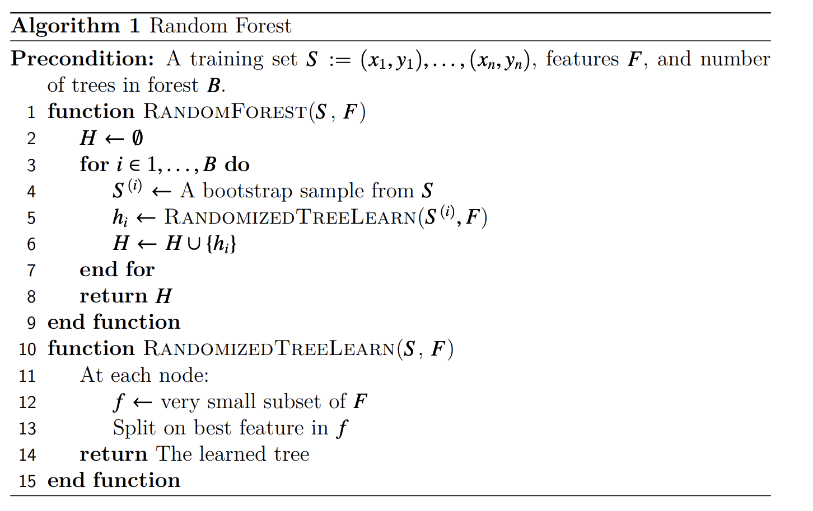

# 15418-Project-Miracle-Gro
Miracle-Gro Project for Fast Parallel Training and Inference of Random Forest Models

# URL
[Miracle-Gro Project Page](https://dinodeep.github.io/15418-Project-Miracle-Gro/)

Raw URL: [https://dinodeep.github.io/15418-Project-Miracle-Gro/](https://dinodeep.github.io/15418-Project-Miracle-Gro/)

# Summary
We are going to implement a version of the Random Forest Machine Learning Model that is implemented in  Python's `sklearn`'s library in C++ parallelize it. We will be parallelizing it using OpenMP's task construct to create parallel work within a given decision tree within the forest and across the random forest.

# Background
The application that we are going to parallelize is the Random Forest machine learning algorithm. This algorithm is an ensemble-based supervised machine learning algorithm that trains multiple independent decision tree models on a bootstrapped subsets of the original training dataset from machine learning. During prediction, the predicted samples are passed through each of the trees, and then, their results are combined to get an expected output for the input. The high-level algorithm for generating the random forest classifier can be found below.

 

Source: [University of Wisconsin-Madison](https://pages.cs.wisc.edu/~matthewb/pages/notes/pdf/ensembles/RandomForests.pdf)

There are a number of avenues of improvement for exploiting parallel regions of code. For example, each tree in the random forest can be generated in parallel. Furthermore, the within each tree, the various branches of the decision tree can be generated in parallel as well as they are independent regions of code. As a result, the algorithm for training the random forest model has parallelism that can be exploited to a high degree.

# The Challenge

This problem can be challenging to parallelize because there is sequential dependencies when training individual decision tree models for the overall random forest classifier. Furthermore, because there are a lot of different spaces for parallelism, there is likely a balance on what sections of the code to parallelize with the limited resources that we have access to when running our code on parallel machines. 

The primary dependencies in the code are mostly related to the need to implement the prior nodes in the decision tree algorithms for later nodes in the list. Another important difficulty is that we need to determine the best splits for each node when performing the algorithm which reduces the amount of time. Furthermore, when creating a single decision tree, there is significant computation required to determine the best split for the tree.

One property of the system that makes this workload challenging is that there is a lot of shared memory that is being used between different trees and various nodes within trees, and as a result, this can make it difficult to make sure that there arent' any issues with have race conditions on shared memory. As a result, we must make sure to be extra careful to avoid these kinds of issues.

# Resources

We will use the gates machines to train our models. We will probably not use any type of starter code. Our plan is to first write an implementation of the random forest algorithm in C++. In order to write this implementation, we will reference implementations in Python from packages such as scikit-learn. The reference can be seen here: [sklearn Documentation](https://github.com/scikit-learn/scikit-learn/blob/9aaed4987/sklearn/ensemble/\_forest.py#L1081). 

# Goals and Deliverables

## What We Plan to Achieve
The following are the goals that we definitely want to complete during the timeline of this project as well as what we define as a successful project. 
- Write a working implementation of the Random Forest Algorithm in C++.
- Profile the performance of the sequential algorithm to determine where most of the time is spent in the program to determine what components of the Random Forest training and prediction algorithsm to most heavily focus on efficient parallelization.
- Parallelize this algorithm using OpenMP and perform experiments to analyze speedup and limitations to speedup in the original implementation. 

## What We Hope to Achieve
We hope to achieve the following given that our prior portions of the project work out well and allow us the time to pursue other goals
- Implement the parallel decision tree algorithm in other parallel programming models and potentially using hybrid programming models to improve performance such as mixing MPI across trees and OpenMP within trees to perform more efficient training and prediction.

## Poster Session Demo
We plan to demo our algorithm at the poster session where we will train our Random Forest algorithm on various datasets using our sequential implementation and then show the performance improvements using the our parallel version of the algorithm. We will show the comparable accuracies of the sequential and parallel algorithms which should show similar performance; however, we will show plots displaying how the parallel algorithm has strong speedup. Furthermore, we will generate plots on how speedup for training and inference time change with the number of processors for our workloads and show that our algorithms significantly improve the speedup.

## System Capability and Desired Performance
While this is not exactly a systems project, we hope to see that this algorithm will train models with similar accuracy compared to those the models trained sequentially; and furthermore, we hope to reach near-linear speedup for the performance of our parallel algorithm in comparison to the sequential algorithm.

# Platform Choice
Our platform for developing our algorithm is the Bridges-2 machines and the Gates cluster machines. This makes sense because they allow us to perform shared memory parallelism that allows us to parallelize the random forest algorithm without having to worry about the difficulties of message-passing memory models which is much more complex for recursive algorithms like decision trees which the random forest is made up of. Furthermore, we will be using the C++ programming language to implement our models because the C++ programming language is efficient, and it allows us to write implementations in OpenMP, allowing us to take advantage of the parallel programming mdoels that we have been using in class. Furthermore, we will implement a sequential version of the random forest algorithm in C++ so that we are not unfairly comparing the performance of Python's `sklearn` implementation (which has overhead from Python) with a purely C++ based model.

# Schedule

- [DONE]: Week of 4/2-4/8: Start on implementation of Random Forest in C++. Reference source code from \texttt{sklearn}. 
- [DONE]: Week of 4/9-4/15: Finish writing implementation of Random Forest. Start on profiling of the sequential implementation. Perform experiments to show what parts of the code are the slowest and where there is the most room for improvement with parallelism. 
- [In Progress]: By Midway 4/19: Finish sequential implementation and profiling. (Deep)
  - [Done]: By 4/17: finish writing the sequential implementation and finding dataset for performing profiling (Deep)
  - [In Progress]: By 4/19: complete profiling of the sequential profiling and determine the slow portions of training the random forest model and define specific conditions for experimentation with parallelized version.
- [Not Started]: Week of 4/16-4/22: Start optimizing sequential implementation using OpenMP. (Meher)
  - [In Progress]: By 4/20: complete an initial parallelization of the random forest training process by training trees in parallel
  - [Not Started]: By 4/22: improve the parallelization by performing fine-grained parallelized training by parallelizing a finer task in the training process that is expensive (determined by profiling the sequential implementation) and by parallelizing the prediction of the random forest.
- [Not Started]:  Week of 4/23-4/29: Perform further experiments to compare the new parallel implementation to the original sequential implementation. (Deep)
  - Not Started: By 4/26: Complete experiments comparing the speedups of training the random forest model's sequential implementation versus the parallel implementation on various dataset, and then, compare the results using different parallelized components.
  - Not Started: By 4/29: Accumulate the results into a writeup and compare the results by running the experiments with a higher core count on the PSC machines.
- [Not Started] Week of 4/30-5/4: Put together final deliverables and prepare for final demo. (Meher)
  - Not Started: Begin generating plots describing the speedup of the parallel version over the sequential version for both training and prediction of the random forest model using various datasets. Furthermore, find demo that can be run during the poster session that describes the performance improvements and trade-offs considered in training the parallel random forest in comparison to the sequential one.
  - Not Started: Produce final poster and confirm the demo that will be run during the poster session.
