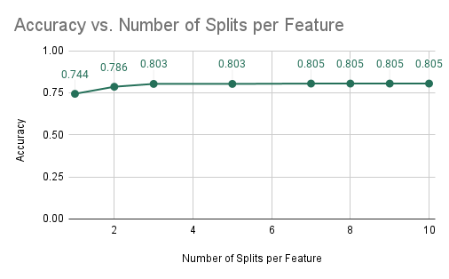
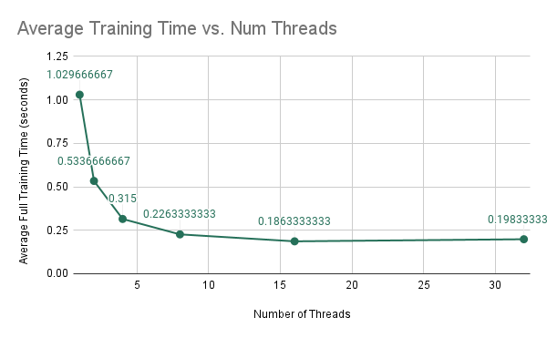
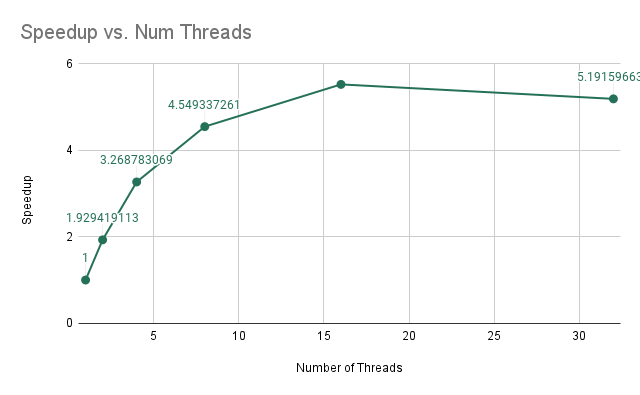
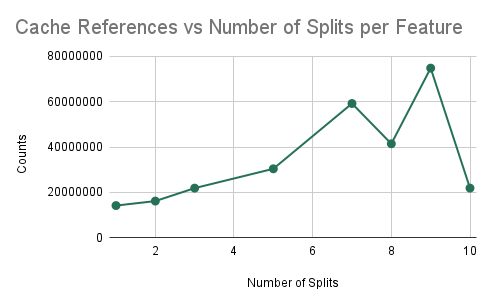
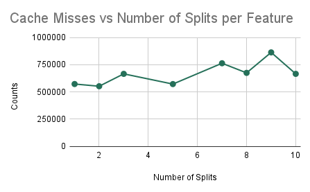
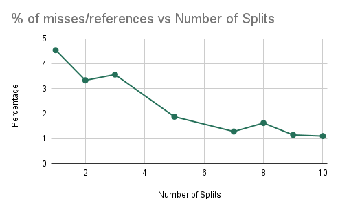
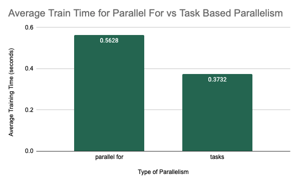
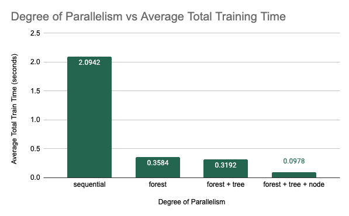
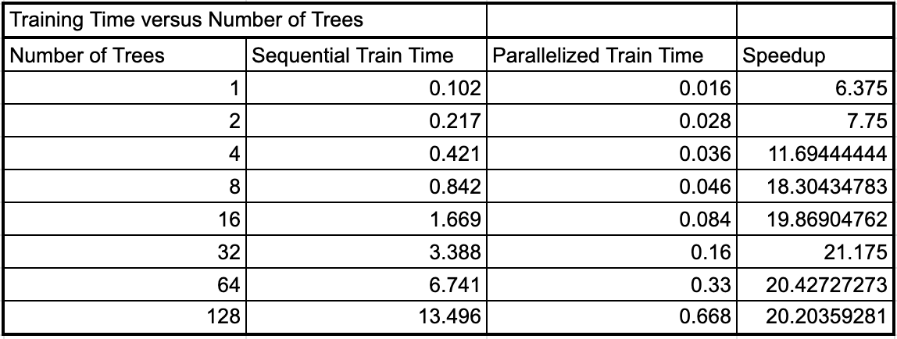
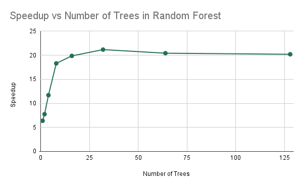

# 15418-Project-Miracle-Gro
Miracle-Gro Project for Fast Parallel Training and Inference of Random Forest Models

# Milestone Report
<a href="15418-project-milestone-report.pdf">Milestone Report PDF</a>

# URL
[Miracle-Gro Project Page](https://dinodeep.github.io/15418-Project-Miracle-Gro/)

Raw URL: [https://dinodeep.github.io/15418-Project-Miracle-Gro/](https://dinodeep.github.io/15418-Project-Miracle-Gro/)

# Summary
We implemented a version of the Random Forest Machine Learning Model that is implemented in  Python's `sklearn`'s library in C++ and parallelized it using the 8-core GHC machines. We parallelized the sequential algorithm using OpenMP's task construct to create parallel work both across decision trees in the forest as well as within a given decision tree.

# Background

The machine learning application that we have parallelized is the Random Forest machine learning algorithm. This algorithm is an ensemble-based supervised algorithm that trains multiple independent decision tree models on bootstrapped subsets of the original training dataset. The algorithm is trained on a dataset that includes dataset entries that have features as well as a label, hence supervised learning. The goal is to be able to accurately predict the label for a new data point. 

This random forest classifier is effectively a list of independent binary trees that have data and decisions stored in their child nodes. The random forest data structure primarily consists of two main functions in its API which are described below

- `fit(data, labels)` -> None;

    data is a $N \times M$ matrix where there are $N$ samples in the dataset and there are $M$ features per sample. Furthermore, labels are $N \times 1$ matrix which is simply the label for each sample. This function modifies the data structure to allocate decision trees and train them by finding nodes of best split. Some of the computationally expensive portions of this function are finding the best split to split a non-leaf node at which requires iterating throughout the dataset multiple times for multiple different potential splits. Furthermore, there are opportunities for parallelism which will be described below.

- `predict(data)` -> predictions;

  data is an $N \times M$ matrix which we are trying to perform prediction with using a trained random forest classifier. The output predictions are an $N \times 1$ matrix containing the output predictions per sample. The expensive portions of predictions require iterating through the tree and finding which leaves in the tree the samples map to which is not as parallelizable because each move left or right in the tree on the path to a node is dependent on the prior decision along the path.

For demonstration, we ran our random forest algorithm on [Firat University's Internet Firewall Dataset](https://archive.ics.uci.edu/ml/datasets/Internet+Firewall+Data) which contains 11 different features and 65532 samples, each classifying to one of 4 classes. The features and classes are listed below.

- Features: source port, destination port, NAT source port, NAT destination port, action, bytes, bytes sent, bytes received, packets, elapsed time (sec), pkts\_sent, pkts\_received
- Classes: allow, take action on, drop, or reset-both

We've limited the dataset size from 65532 to 1024 samples in order to maintain reasonable training times using the current implementation of our algorithm. This would allow us to experiment with new parallelization methods as well in a more efficient manner.

During prediction, the predicted samples are passed through each of the trees and their results are combined to get an expected output for the given input. The high-level algorithm for generating the random forest classifier can be found below. 

Furthermore, we have allowed for additional hyperparameters in training on randomized tree algorithm by allowing the depth of the tree to be greater than 1 which allows us to explore more areas to parallelize throughout the algorithm. 

 

Source: [University of Wisconsin-Madison](https://pages.cs.wisc.edu/~matthewb/pages/notes/pdf/ensembles/RandomForests.pdf)

 

There are a number of avenues of improvement that can exploit the potential for parallelism in this code. For example, each tree in the random forest (individual decision tree) can be generated in parallel. Furthermore, within each tree, the various branches of the decision tree can be generated in parallel as well because they are independent regions of code. Additionally, when we are calculating the best split for a given node, that requires iterating over all possible features in our data and considering some set of splits for that feature. Then, we compute the gini-impurity score over all possible splits. Thus, to find the best split, calculating the gini-impurity score for all possible splits is independent of each other. As a result, the algorithm for training the random forest model has model parallelism that can be exploited to a high degree. When providing a prediction, the result is dependent on the predictions from each of the individual decision trees and therefore there are dependencies in the `predict` part of the algorithm. One important aspect to note is that this algorithm is recursive due to the recursive training algorithm of decision trees.

With respect to the various traits of synchronization and communication, the primary dependencies in the training algorithm consist of computing the best split before determining the data that is to be sent to the nodes that are deeper in the tree. However, as mentioned before, due to the independent possible splits and the independent leaf nodes, we can perform the calculation of these objects in parallel. Due to the recursive and conditional nature of training the decision trees, there is little data-parallelism, and instead, model-parallelism is more prevalent to this algorithm. As a result, this algorithm is not necessarily amenable to SIMD execution, and furthermore, there is not as much locality in this algorithm. However, the focus on using shared-memory parallelism allows to us ensure that communication is not as expensive as other parallelism methods such as SIMD and message passing parallelism.

# Approach

## Languages and Technologies Used

This project was written completely in C++. We converted the original Python implementation of random forest from Python into a simplified C++ version so that we could compare a sequential version to our parallel implementation that would be in C++. This removes variability between python and C++. In order to exploit parallelism, we used OpenMP, and we specifically targeted the Gates machines which have 8 cores. Additionally, to deal with using matrices and some basic linear algebra functionalities, we utilized the \texttt{Eigen} C++ library for running this algorithm.

## Mapping Between Data Structures and Hardware

As described more in-depth below, we have used multiple methods for parallelizing the implementation of the training of the random forest algorithm. Instead of having multiple decision trees (within a random forest) train on a single thread, utilizing OpenMP task-based threading, we were able to move the creation of each tree (a single task) to different threads. Thus, each tree in a forest was mapped to a single thread on the machine.

Furthermore, we've represented the training of a single node within a tree as an OpenMP task as well. Thus, we have that nodes are mapped to a single thread that is working to complete its computation. Finally, for the finest-level of parallelism, we are representing the computation of the gini-impurity score for a single split as a task within OpenMP as well. Thus, the work of computing that gini-impurity score is also mapped to a thread for work. Regardless, all pieces of independent work are being mapped to a single thread that will complete its execution due to the fact that we are using the OpenMP parallelism model for training.

## Code Profiling

Given our pre-existing knowledge about the random forest algorithm, we had some idea of what areas of the sequential code had the most opportunity for parallelization. This included parallelizing the training of individual random trees within a forest, as they are all significant and independent pieces of computation. Furthermore, from our prior experience with Lab 3 using OpenMP to improve the speedup for an N-body simulation, we noticed that the tree-like structure exhibits a very similar structure to that of the quad-trees in Lab 3. Thus, we noticed that we can parallelize the creation of the children as well. Furthermore, we believed that there were other opportunities for parallelizing this algorithm to make it more efficient, specifically for the computation within a single node. In order to confirm our hypothesis as well as find other areas for improvement that we may not have thought of, we started by profiling the sequential implementation of the random forest algorithm. 

In order to profile our code, we placed timing code around the main areas of the implementation. We got a total time for training a single decision tree. Within training a decision tree, in the `fit` function, the three main portions of computation were determined to be the calls to `find_best_split`, `split`, and the recursive calls for training the children. We placed individual timers around these calls to gain a more granular look at which portions of the code were slow. A sample of the outputs that were received is below.

```
Find Best Split takes: 0.014s
[node=  <root>,L,L,L,L,L] time=0.0144
        [node=  <root>,L,L,L,L,L] elapsed-find-split=0.0139
        [node=  <root>,L,L,L,L,L] elapsed-split=0.0003
[node=  <root>,L,L,L,L] time=0.0287
        [node=  <root>,L,L,L,L] elapsed-find-split=0.0139
        [node=  <root>,L,L,L,L] elapsed-split=0.0004
[node=  <root>,L,L,L] time=0.0434
        [node=  <root>,L,L,L] elapsed-find-split=0.0142
        [node=  <root>,L,L,L] elapsed-split=0.0004
[node=  <root>,L,L] time=0.0580
        [node=  <root>,L,L] elapsed-find-split=0.0142
        [node=  <root>,L,L] elapsed-split=0.0003
[node=  <root>,L] time=0.0754
        [node=  <root>,L] elapsed-find-split=0.0169
        [node=  <root>,L] elapsed-split=0.0004
[node=  <root>] time=0.1068
        [node=  <root>] elapsed-find-split=0.0303
        [node=  <root>] elapsed-split=0.0007
Done Training Tree: 19
Full Parallel Training Time: 2.084s
```

As we can see here, for each individual non-leaf node, the time to find the best split is several times larger than the time to split all the data at that node. On average, we found that actually splitting the data was not significant in training time in comparison to the rest of the code. We found that on average $25\%$ of computation was spent finding the best split, while the remaining time was mostly spent on training the children nodes, which will be computed in parallel as described below. However, we discovered a new portion of code to parallelize which was focusing additional parallelism on the `find_best_split` logic rather than the splitting logic of the code.

## Parallelizing the Sequential Implementation and Iterations of Optimization

Given these takeaways from profiling the sequential implementation, we worked towards parallelizing on three levels separately and then combining them: forest level, tree level, node level. Forest-level parallelism will refer to parallelizing the training of independent decision trees in the forest in parallel. Tree-level parallelism will refer to parallelizing over the creation of the left and right branch of a single decision tree in parallel. Node-level parallelism will refer to the parallelizing computation such as finding the best feature to split on at a single node. 

The first was training each of the decision trees in parallel rather than in sequence, forest-level parallelism. By the nature of the random forest algorithm, each of the decision trees in the forest is independent and the trees together are used to increase the accuracy of prediction. Because the training of each tree does not depend on the training of any other tree, each decision tree can be trained in parallel. We used OpenMP to achieve this optimization. We started with the most basic implementation of placing `#pragma omp parallel for` before the for loop that loops over the number of trees that are being created. We then experimented with different task schedules as well as different numbers of threads, timing each configuration to see which provided the best results. The results of these experiments will be shown later in the results section. We also implemented this parallelism using tasks rather than `parallel for` and compared these results in the later section as well. 

The next method of parallelization was parallelizing the training within a given decision tree, tree-level parallelism. When training a single non-leaf node in a decision tree, when training its left and right children nodes, we can notice that they are independent pieces of computation. As a result, we can perform the training for the left child node and the right child node in parallel. In order to do this, we attempted to use scheduling such as `#pragma omp parallel for` as well as task-based parallelism and compared the results of these along with the forest-based parallelism. 

The final method of parallelization was node-level parallelism. One important note was that this algorithm was originally implemented by performing a minimum reduction over the gini-impurity scores over all possible splits. We realized that finding the best split is a computation that implicitly has a lot of potential for parallel computation. In order to exploit this parallelism, we changed the way that we implemented finding the best split (changed `find_best_split` to `find_best_split_parallel_dim` slightly from the sequential implementation. In the sequential implementation, we first looped over all the possible splitting indices, calculated all possible splits, then for each split, we found the one that minimized the gini-impurity index. To parallelize this, we calculated the potential splits for that index. We then looped over all these splits, estimated the gini score for each of those splits, and updated reduction variables to keep track of the best split. 

Instead of this, we reconfigured the code to be for loops. We first find the best splitting value for each feature that we can split on in parallel. We then reduce over all these possible split indices/values to get a global best decision for that node. We keep track of a vector called `best_splits`. Each index in `best_splits`, holds the best splitting value if you split on that split index. In order to calculate these values, we used a nested for loop. The outer loop goes over all the possible split indices. We then calculate all the possible splits and loop over those to find the local best splitting value for the current feature. We then store this in `best_splits`. Outside this nested loop, we again loop to find the global best splitting index and value over all the possible features and this is returned. 

Overall, this process required several iterations to develop and improve. Within each method of parallelism, we experimented with `parallel for` and task-based parallelism. We also looked at different scheduling methods for forest-level parallelism. We then experimented with many different ways of combining these levels of parallelism: just forest, forest and tree level parallelism, or forest+tree+node level parallelism (with parallel for and task-based). The results of all of these experiments are discussed in more detail in the results section. However, in the end, we used a task-based implementation of all of the methods of parallelism. Combining all of them resulted in the largest speedup which will be described below.

# Results

In the sections below, we will discuss the setup and results of each of the experiments that we conducted. All experiments were conducted on the GHC clusters which had 8-core machines. 

## Experiment 1: OMP Schedules and their Impact on Training Time

The first set of experiments focused on looking at parallelization at the forest level. This means that we were parallelizing over the creation of independent decision trees in the forest. The setup for this experiment was training 10 decision trees with a maximum depth of 5.  The first method of parallelization that we looked at was using \texttt{\#pragma omp parallel for}. In this experiment, we compared total training time in seconds for the sequential implementation against several different scheduling strategies. Each configuration was run 5 times and the average training times are shown below. 

 

*Average Training Time for Different OMP Task Schedules*

We can see from this graph that there was a significant decrease in total training time when we parallelized over the trees with a simple `#pragma omp parallel for`. As we have discussed before, this is because the individual decision trees in a random forest are completely independent and therefore easily parallelizable during training. The different schedules did provide some more speedup with the guided schedule producing the best results, with an average of 0.403 seconds over the 5 trials. In general, we may see that the static schedule did slightly worse than the dynamic and guided schedules because the computational complexity of training each decision tree may be highly variable depending on the splits that are chosen. As a result, having a static assignment of threads to work may not be the most optimal way to assign work to the threads. With the dynamic schedule, threads will be assigned to the next tree that is ready to be trained which allows for more flexibility despite the larger cost for scheduling work. The guided schedule, which is somewhat similar to the dynamic schedule except that the size of the chunk is proportional to the number of unassigned iterations and therefore as computation continues, the size of the chunk will decrease. This scheduling type works best when iterations are poorly balanced with respect to the amount of computational cost because the larger chunks reduce overhead of scheduling at the start and the smaller chunks fill the schedule towards the end of the computation and improve load balancing. Therefore in random forest, where iterations are quite variable, this scheduling method would be expected to perform slightly better, as we saw in this experiment.

## Experiment 2: Impact of Number of Splits per Feature on Training Time

In the following few experiments, we looked at the impact of the constant `NUM_SPLITS_PER_FEATURE` on other values. The experimental setup was the same: 10 decision trees with a max depth of 5. This experiment was run given the results from the previous. Therefore, we are currently implementing forest-level parallelism for all trial runs using a guided schedule. In this experiment, we looked at the impact of the number of splits per feature on the accuracy and average training time of the random forest algorithm. The results are in the two plots below. 

 

 

*Accuracy and Training Time vs NUM_SPLITS_PER_FEATURE*

As can be seen from the plots, the average training time significantly increases as the number of splits per feature is increased. This is expected because as we increase the number of splits that are being computed per feature, this significantly increases the computational cost of training a single decision tree as we have to consider may more splits. However, we notice that the accuracy of the model does not significantly increase as we consider many more splits. This means that these large numbers of splits are not learning much more information about the dataset and therefore may not be needed. As a result, we can pick the smallest number of splits that gives us an accuracy that is acceptable. We see that from 3 splits to 10 splits, the accuracy only increases from 0.803 to 0.805. However, the average training time increases from 0.142 seconds to 0.49 seconds. Therefore, we determined that this small increase in accuracy is not worth nearly 3.5 times the training time and therefore we chose 3 to be the optimal number of splits per feature that maximizes accuracy while keeping a reasonable training time.  

Thus, in the context of actually performing machine learning, if we are attempting to find a model that is both accurate and efficient, we would primarily target a model that is described above, one that is efficient by changing the amount of available parallelism and that maintains a strong performance.

## Experiment 3: Number of Threads and the Impact on Training Time

Again for this experiment we are training a random forest of 10 trees, each with maximum depth 5. Our goal is to determine how the performance of training the model changes as we are increasing the number of threads on the Gates machines using forest-level parallelism. The results are shown below.
 
 
 

As we are increasing the number of threads, we find that the average run-time of the model decreases in a non-linear fashion. When we analyze the speedups, we find that the speedups are not exactly linear, but somewhat sub-linear, in which we are initially getting linear improvements in speedup; however, as we increase the number of threads from 4 to 8, we find that the speedup does not increase as much. This is due to the increase in computation per thread because as we increase the number of threads, there is less computation per thread while the amount of synchronization remains the same. As a result, we get that we have sub-linear improvements.

## Experiment 4: Cache Analysis as we Increase Communication
As in prior experiments, we are training a random forest with 10 trees, each with a maximum depth of 5 nodes. However, in this experiment, we plan on determining the efficiency of the algorithm as we increase the number of splits (i.e. the amount of communication). The results here will imply how well the algorithm performs as we try to scale up the accuracy of the model.

 

 

 

 

*Cache Misses/References and Training Time vs NUM_SPLITS_PER_FEATURE* 

We find that as we are increasing the number of splits that we are considering for training each decision tree, we can notice that increasing the number of splits decreases the ratio of the number of cache misses over the number of cache references. As a result, we find that if we try to create a more accurate classifier (by increasing the number of splits), the performance of our parallel algorithm will not decrease significantly due to a larger amount of computation. Instead, we simply find that the ratio of cache misses to cache references decreases and plateaus, which signifies that there will be beneficial performance for a model that is trying to be more accurate, despite the increase in computation. We can notice that doubling the number of splits leads to a less than double performance time measured in wall-clock time which shows that speedup is not worsened.

## Experiment 5: OMP Parallel For Versus OMP Tasks

In this experiment, we focused on parallelization at the forest-level and the tree-level. We had two different ideas for parallelization at this level. We could either use \texttt{\#pragma omp parallel for} which spawns several threads for different iterations of the for loop to parallelize computation over trees in the forest and branches in each tree. Or we could use task-based parallelism. We wanted to figure out whether there was any difference in performance between these two methods. For the experimental setup, we trained each of these methods for 5 trials with 20 decision trees in the forest and a maximum depth of 5. The average training time over the 5 trials is shown for the two different methods below. For the "parallel-for" column, both forest-level and tree-level parallelism were implemented using \texttt{\#pragma omp parallel for}, thread-based parallelism. For the task-based category, iterations of the for loop over decision trees as well as the recursive calls to train the left and right branch within a decision tree were instead spawned as new tasks. The results of the experiment are shown below. 


 

*Compare Training Time of Parallel for vs Task-Based Parallelism* 

As we can see, the training time was much better when implemented with task-based parallelism. One observation that we made was that the training time for thread-based parallelism in this experiment was nearly the same whether we allocated the for loop of a single tree as parallel or not. This may have been because the outer loop over all the trees was using too many threads and so not enough threads were available to allocate different branches of a single tree to different threads. Therefore, this method did not see much benefit from parallelizing at the tree-level. However, when we look at task-based parallelism, we were able to define training a single tree as a task. We were also able to define training the left and right branches of a single tree as subtasks. This provided more granularity and allows threads to be assigned to smaller tasks to ensure that both forest and tree-level parallelism could be seen at the same time. 

## Experiment 6: Final Performance Speedup using Paralellism at Multiple Granularities

After implementing each of the individual levels of parallelism: forest-level, tree-level, and node-level, we wanted to examine which combination of these methods of parallelism would provide the best speedup. The obvious assumption was that combining all three methods would result in the best training time. The experimental setup for these trials was training 20 decision trees with a maximum depth of 5. Each individual method of parallelism was implemented using task-based parallelism for this experiment. For each degree of parallelism, we ran 5 trials and the average training time is plotted in the figure below. 


 

*Average Training Time vs Degree of Parallelism Implemented* 

As was expected, combining all three methods of parallelism resulted in the best performance. We saw a 21.42$\times$ speedup from from 2.0942 seconds for the original sequential implementation to 0.0978 seconds for the fully parallelized implementation using an 8-core machine. A more specific breakdown of the speedup can be found below.

- Best Single-Threaded Sequential Implementation: speedup is 1.0 $\times$
- Forest Parallelism: speedup is 5.84 $\times$
- Forest and Tree Parallelism: speedup is 6.56 $\times$
- Forest, Tree, and Node Parallelism: speedup is 21.42 $\times$ 

## Examining Problem Size

With our final parallel implementation, we then wanted to look at the difference in speedup that we were able to achieve based on the size of the problem. In this case the size of the task is proportional to the number of decision trees in the random forest. For the final experiment, we trained the original sequential implementation from the proposal as well as our final parallel implementation with several different forest sizes to determine whether the speedup would be different for different problem sizes. The result of these tests are shown below. 

 

*Seqential and Parallel Training Time for Different Problem Instances* 

 

*Speedup vs Problem Instance Size* 

As we can see, as the number of trees in the forest doubled, the sequential training time nearly exactly doubled as well. This is because we are doing nearly double the work if we have to train two times as many trees in sequence. However, the parallel training time increased by less (between 1.75 and 1.9) each time the number of trees were doubled. As a result, we see that the speedup increases as the number of trees increases up until about 16-32 trees, and then the speedup levels off. This may be because as the number of trees in the forest increases past 64, all of the threads on the machine are occupied to near their maximum capacity where the thread are reaching their maximum utilization for this algorithm. So as we double the work further, we see that it takes nearly twice as much time for the parallel implementation between 64 and 128 trees. 

## What limited speedup?

As we can see in Experiments 3 and Experiments 6, we see that we are getting sub-optimal speedup when we are increasing the number of threads and that our speedup is limited by the size of the problem, which can be expected. If we have a very small number of trees, we can notice that the speedup is not linear due to the fact that the speedup is less than the number of threads which we have which is 8. Thus, we can see that experiment 3 tells us that our algorithm is limited in speedup due to communication. Because we are increasing the number of threads and decreasing computation per thread, we find that the amount of synchronization is staying the same, which is some portion of dependencies in our code. Thus, we have an irreducible time that must occur due to synchronization, leading to sub-linear speedup. Furthermore, we have that our speedup is limited when we have few trees, and as a result, that explains that with some fixed amount of resources, we are prevented from reaching full parallelism if our problem set size is too small. As a result, our speedup is overall limited by the synchronization and the overall problem set size.

## Deeper analysis: profiling of code
After performing some additional profiling of our code, when training a random forest with 10 trees and a maximum depth of 5, we get that the total time to execute it in parallel is approximately 0.0516 seconds. Of this time, 100% of the time is spent training trees. Because we have required synchronization and dependencies, the portion of the code that we can analyze in discrete steps is the fitting of a single node in the tree and its children. Of the time spent fitting the root node, we find that because we have parallelized the algorithm for finding the optimal split but we didn't parallelize the actual splitting, we find that when training a node, approximately 40% of training a node is spent finding the optimal split while 60% of the time is spent actually splitting the data. Because we haven't explored performing parallelization to split the data, this is another area that can be explored to improve the performance of training the random forest model.


## Analyze choice of machine

We believe that our choice of machine (shared-memory model machine) is sound because it allows us to perform parallel algorithms that are recursive very easily. Furthermore, because these algorithms are conditional (we are splitting the data based on the node that it belongs to), we find that using a SIMD architecture such as a GPU would not be beneficial for the case of this algorithm as we would have a lot of divergent execution. However, that does not influence the shared-memory models, making performance for it very strong in comparison to other models.

## References
    - Reference Python Code Converted to C++: [https://scikit-learn.org/stable/modules/generated/sklearn.ensemble.RandomForestClassifier.html](Scikit-Learn Random Forest Algorithm)
    - Dataset: [https://archive.ics.uci.edu/ml/datasets/Internet+Firewall+Data](Firat University's Internet Firewall Dataset)
    - Reference Image for Random Forest Algorithm: [https://pages.cs.wisc.edu/~matthewb/pages/notes/pdf/ensembles/RandomForests.pdf](University of Wisconsin-Madison)

